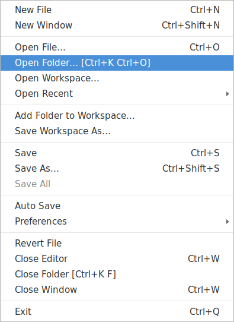

# Wie man mit Ordnern in VS Code arbeitet

VS Code ist von Anfang an auf Projektordner spezialisiert. Hier ein paar Hinweise, wie ihr
diesen Umstand für euch ausnützen könnt.

### Einen Ordner auswählen

Der erste Schritt: Wählt im **"File"**-Menü "`Open Folder...`" aus. Klickt euch durch,
bis ihr den richtigen Ordner gefunden habt; dann auf `Open` klicken.

Das war's eigentlich schon. Wenn ihr die *Explorer*-Ansicht ausgewählt habt, wird VS Code
das "richtige" Verzeichnis anzeigen.

Auch im *Terminal* befindet ihr euch jetzt in eurem Projektordner -- wenn ihr
z.B. *PyTest* an der richtigen Stelle starten wollt.

