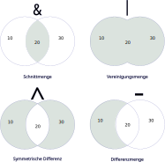

# Mengen und Sets


### Wofür braucht man sowas?

Man braucht Mengen und ihre Beziehungen immer dann, *wenn man sich für eine
Menge im Verhältnis zu einer anderen Menge interessiert.*

Dazu ein Beispiel: Ich musste mal für die Webseite eines Second-Hand-Ladens
eine kleine Datenbank über Bilddateien führen. Man erwartete, dass von jedem
Bild Informationen in dieser Datenbank zu finden waren: Wann es gemacht wurde,
seine Originalbreite, seine Originalhöhe, seine Größe in Kilobytes, eine kurze
Beschreibung usw.  Am Ende waren es über 5000 Bilder, die auf diese Weise
dokumentiert werden sollten, und irgendwann ergab sich die Frage:

> Welche Bilder sind in der Datenbank noch nicht erfasst?

Um diese Frage zu beantworten, konnte ich in Python natürlich mit einer
Schleife arbeiten:

```py
realImages = getRealImages(CONFIG['imageDir'])
dbImages = getDBImages(CONFIG['database'])
noDBImages = []

for rImg in realImages:
    if rImg not in dbImages:
        noDBImages.append(rImg)

```

Oder aber ich machte mir die Möglichkeit zunutze, dass man mit Python-Sets eine *Differenzmenge* bilden kann:

```py
noDBImages = realImages.difference(dbImages)
```

D.h. die Menge aller "realen" Bilddateinamen "minus" die Menge aller
Bilddateinamen in der Datenbank ist die Menge aller Bilddateien, die in der
Datenbank noch nicht erfasst sind.

Das war kürzer, eleganter, und dazu auch noch um einiges schneller als die
Lösung mit der Schleife, denn Python kann für diesen Lösungsweg
Optimierungsmöglichkeiten nutzen, die bei der Schleifenlösung nicht einsetzbar
sind (wie den rekursiven Abgleich z.B.)


### Übersicht: Mengenverhältnisse

Das folgende Bild zeigt die Möglichkeiten in Python mit Hilfe einer sehr
einfachen Darstellung:

<p style="margin-left:5rem;margin-top:3rem;margin-bottom:4rem">

</p>


Gegeben sind zwei Sets:

```py
klein = { 10, 20 }
gross = { 20, 30 }
```

Die **Schnittmenge** (intersection) beinhaltet nur die Elemente, die in
*beiden* Mengen enthalten sind:

```py
mySchnittmenge = klein.intersection(gross)
# ab Python 3.6 auch moeglich:
mySchnittmenge = klein & gross
# => {20}
```

Die **Vereinigungsmenge** (union) beinhaltet alle Elemente *beider* Sets. Da
sie selbst wieder ein Set ist, sind Dubletten von vornherein ausgeschlossen.


```py 
myVereinigungsmenge = klein.union(gross)
# ab Python 3.6 auch moeglich:
myVereinigungsmenge = klein | gross
# => {10, 20, 30}
```

Die **Differenzmenge** (difference) beinhaltet die Elemente einer Liste *ohne*
die Elemente, die in der Schnittmenge mit der anderen Liste stehen.


```py
myDiffMenge = klein.difference(gross)
# ab Python 3.6 auch moeglich (Reihenfolge beachten!):
mySchnittmenge = klein - gross
# => {10}
```

Die **symmetrische Differenzmenge** (symmetric difference / exclusion) beinhaltet die Elemente beider Mengen, die *nicht in der Schnittmenge* enthalten sind:


```py 
mySymDiffMenge = klein.symmetric_difference(gross)
# ab Python 3.6 auch moeglich:
myVereinigungsmenge = klein ^ gross
# => {10, 30}
```

