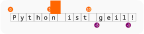

# Nützliche String-Funktionen

## Zeichen Schützen

```py
>>> print("Sie sagte: \"Du mich auch!\" Dann legte sie auf.")
Sie sagte: "Du mich auch!" Dann legte sie auf.

# Neue Zeile einfügen.
>>> print("Frage: Was tragen Schotten unter dem Kilt?\nAntwort: Socken und Schuhe!")
Frage: Was tragen Schotten unter dem Kilt?
Antwort: Socken und Schuhe!
```

## Groß Und Klein

```py
# Alles groß
>>> "bobby".upper()
'BOBBY'

# Alles klein
>>> "BOBBY".lower()
'bobby'

# Jeder Buchstabe "geflippt"
>>> "bObBY".swapcase()
'BoBby'

# Erster Buchstabe groß
>>> "bobby".capitalize()
'Bobby'

# Alle Wortanfänge groß
>>> "Game of thrones: winter is coming".title()
'Game Of Thrones: Winter Is Coming'
```
## Text im Text

```py
# "score" im Text vorhanden?
>>> "score" in "four score and seven years ago ..."
True

# "score" nicht im Text vorhanden?
>>> "score" not in "four score and seven years ago ..."
False

# "dozens" nicht im Text vorhanden?
>>> "dozens" not in "four score and seven years ago ..."
True

# Alternativ
>>> not "score" in "four score and seven years ago ..."
False

# Alternativ
>>> not "dozens" in "four score and seven years ago ..."
True
```

## String-Statistik

```py
# Stringlänge
>>> len("four score and seven years ago ...")
34

# Buchstabe mit kleinster ASCII-Ordnungszahl
>>> min("four score and seven years ago ...")  
' '

# Buchstabe mit größter ASCII-Ordnungszahl
>>> max("four score and seven years ago ...")
'y'
```

## Strings aus Strings "ausschneiden" (Slicing)

Python macht es uns leicht, kürzere Strings aus längeren Strings
"heraus zu schneiden". Man muss allerdings verstehen, wie Python dabei vorgeht.
Dabei hilft diese kleine Grafik:

<p style="padding-left: 3rem;">
  
</p>

Wie man sieht, orientiert sich Python beim Slicing an den "Zaunpfählen", nicht an
den Abschnitten/Buchstaben. Dabei gilt:

* Der erste Zaunpfahl hat die Index-Nummer 0
* `myString[1:5]` bedeutet "von Zaunpfahl 1 bis Zaunpfahl 5". Es werden also nur **vier** Buchstaben ausgeschnitten!

Schauen wir nun auf die Beispiele:

```py
myString = "Python ist geil!"
myString
'Python ist geil!'

>>> myString[0:6]
'Python'

# aus der Mitte
>>> myString[7:10]
'ist'
>>> myString[-9:-6]
'ist'

# "... bis zum Ende"
>>> myString[11:]
'geil!'
>>> myString[-5:]
'geil!'
```

## Strings erweitern, trennen, verbinden, verändern ...

```py
# einfaches Verketten
>>> "four score and seven years ago " + "our forefathers ..."
'four score and seven years ago our forefathers ...'

# Serientext
>>> myString * 3
'Python ist geil! Python ist geil! Python ist geil! '

# Suchen und Ersetzen
myString.replace("geil", "cool".upper())
'Python ist COOL!'

# mehrfach!
myString.replace('i', '<i>')
'Python <i>st ge<i>l!'

# innere Strings löschen
myString.replace('i', '')
'Python st gel!'

# Verkettung: Verstehst du den Witz, verstehst du das Prinzip:
"Andere Länder, andere Sitten".replace('S', 'T').replace('T', 'S')
'Andere Länder, andere Sitten'

# Leerzeichen links löschen
"    Python    ".lstrip()
'Python    '
# Leerzeichen rechts löschen
"    Python    ".rstrip()
'    Python'
# Leerzeichen auf beiden Seiten löschen
"    Python    ".strip()
'Python'

# Strings verketten:
>>> people = [ 'Alice', 'Bob', 'Charlie' ]
>>> joinedPeople = '--'.join(people)
>>> joinedPeople
'Alice--Bob--Charlie'

# Strings wieder aufspalten:
>>> splitPeople = joinedPeople.split('--')
>>> splitPeople
[ 'Alice', 'Bob', 'Charlie' ]
```

